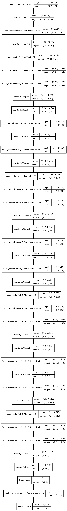

# Convolutional Neural Network in Python
This convolutional neural network was used for the **Kaggle** "Kannada MNIST" contest and **63** out of **1214** participants which is **top 6%**.

## Dependencies
* [tensorflow](https://www.tensorflow.org/)
* [scikit-learn](https://scikit-learn.org/stable/)
* [numpy](https://numpy.org/)
* [panda](https://pandas.pydata.org/)

## CNN model

